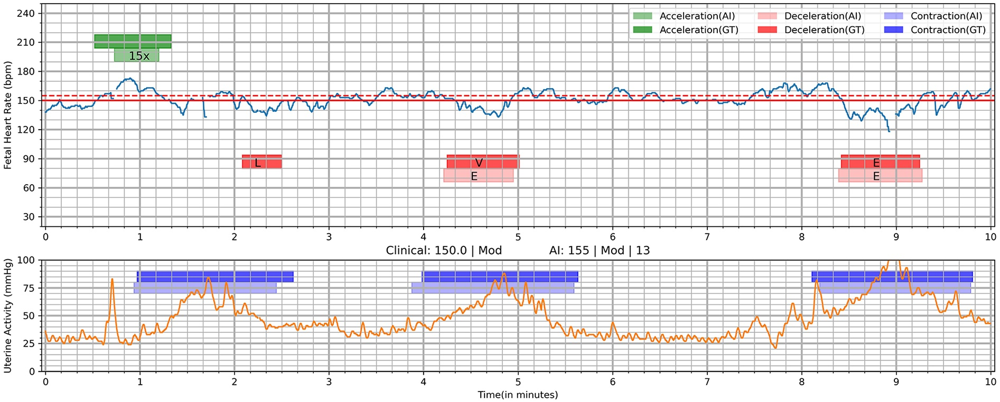

# 🫀 Fetal Health Classification using Cardiotocogram (CTG) Data

## Executive Summary
Cardiotocography (CTG) is a widely used prenatal monitoring technique that records fetal heart rate patterns and uterine activity to assess fetal well-being. 
This project explores a dataset of features extracted from CTG examinations and develops machine learning models capable of classifying fetal health into three categories: Normal, Suspect, and Pathological. Through exploratory data analysis, feature investigation, and predictive modeling, the project demonstrates how data-driven decision support systems can assist healthcare professionals in identifying high-risk pregnancies and improving maternal and neonatal outcomes.

---

## Problem Statement
Reducing child and maternal mortality remains a critical global health priority. While maternal deaths (estimated at 295,000 in 2017) are largely preventable, 94% occur in low-resource settings where access to sophisticated diagnostic tools is limited([The Journal of Maternal-Fetal Medicine](https://onlinelibrary.wiley.com/doi/10.1002/1520-6661(200009/10)9:5%3C311::AID-MFM12%3E3.0.CO;2-9)). CTG monitoring offers a low-cost, non-invasive solution to assess fetal distress via fetal heart rate (FHR), fetal movements, and uterine contractions. However, accurate interpretation is challenging, and missed diagnoses can have fatal consequences. 

The objective of this project is to develop a machine learning classification model that can accurately identify fetal health status based on CTG-derived measurements.

---

## Methodology
- **Data Source:** [Kaggle](https://www.kaggle.com/datasets/andrewmvd/fetal-health-classification) – Fetal Health Classification dataset (Andrew Marvick).
- **Data Overview:** Each record in the dataset represent features extracted from a CTG examination.  
- **Target Variable:** `fetal_health` (classified by expert obstetricians).
  * ***Normal (1.0):*** No signs of fetal distress.
  * ***Suspect (2.0):*** Potential concerns requiring closer monitoring.
  * ***Pathological (3.0):*** Significant abnormalities indicating possible fetal distress and the need for immediate medical attention.
- **Analytical Approach:** This notebook will follow a structured machine learning pipeline guided by the CRISP-DM methodology.
  * ***Exploratory Data Analysis (EDA):*** Examine class distributions, feature correlations, and statistical differences between health categories to uncover early indicators of fetal distress.
  * ***Data Preprocessing:*** Address class imbalance (as pathological cases are typically rare), handle missing values, scale numerical features, and engineer any relevant new features.
  * ***Modeling & Evaluation:*** Implement and compare multiple classification algorithms (e.g., Logistic Regression, Random Forest, Gradient Boosting, XGBoost). Model performance will prioritize recall/sensitivity for the Pathological class to minimize false negatives, as failing to detect a pathological case carries the highest clinical risk.
  * ***Feature Importance Analysis:*** Identify the most influential CTG parameters driving predictions to provide interpretable insights for clinicians.

---

## Results & Business Recommendations

### Results
 - **Class imbalance**: The dataset is imbalanced, with most examinations classified as **Normal (77.9%)**, while **Suspect (13.8%)** and **Pathological (8.3%)** cases are much less common.
- **Baseline models**: Four machine learning models were evaluated on the original dataset. **Gradient Boosting achieved the best overall performance**, with an accuracy of **94.6**%, precision of **96.2%**, recall of **87.4%**, and an F1-score of **90.7%**. **Random Forest** also performed well, while Logistic Regression and K-Nearest Neighbours produced lower recall and F1-scores.
- **Effect of SMOTE**: Applying SMOTE increased the number of minority-class examples during training, making the models more willing to predict **Suspect** and **Pathological** cases. As a result, recall generally improved because more high-risk cases were correctly identified. However, this also increased false positive predictions, leading to lower precision and, in some cases, lower overall accuracy.
- **Important features**: Features related to fetal heart rate variability and decelerations, particularly abnormal short-term variability and prolonged decelerations, showed the strongest relationships with fetal health status and appear to be important predictors.
- The feature importance analysis indicates that measures of **fetal heart rate variability**, **histogram characteristics**, and **prolonged decelerations** are the most influential predictors of fetal health.

### Recommendations
- Although Gradient Boosting achieved the highest overall performance, special attention should be given to the model's ability to identify Pathological cases, as failing to detect a high-risk fetus can have serious consequences.
- The trade-off between precision and recall should be considered carefully. In a clinical setting, correctly identifying more high-risk cases may be more important than achieving the highest possible accuracy.
- Before deployment in a real-world healthcare environment, the selected model should undergo further tuning, validation, and clinical review to ensure its reliability and safety.
---

## Skills
`Python` · `Pandas` · `Seaborn` · `Matplotlib` · `Analysis` · `Jupyter` · `Data Visualisation`

### ***Disclaimer***

This project is intended for educational and analytical purposes only. The developed models should not be used for clinical diagnosis or medical decision-making without appropriate validation, regulatory approval, and oversight from qualified healthcare professionals.
